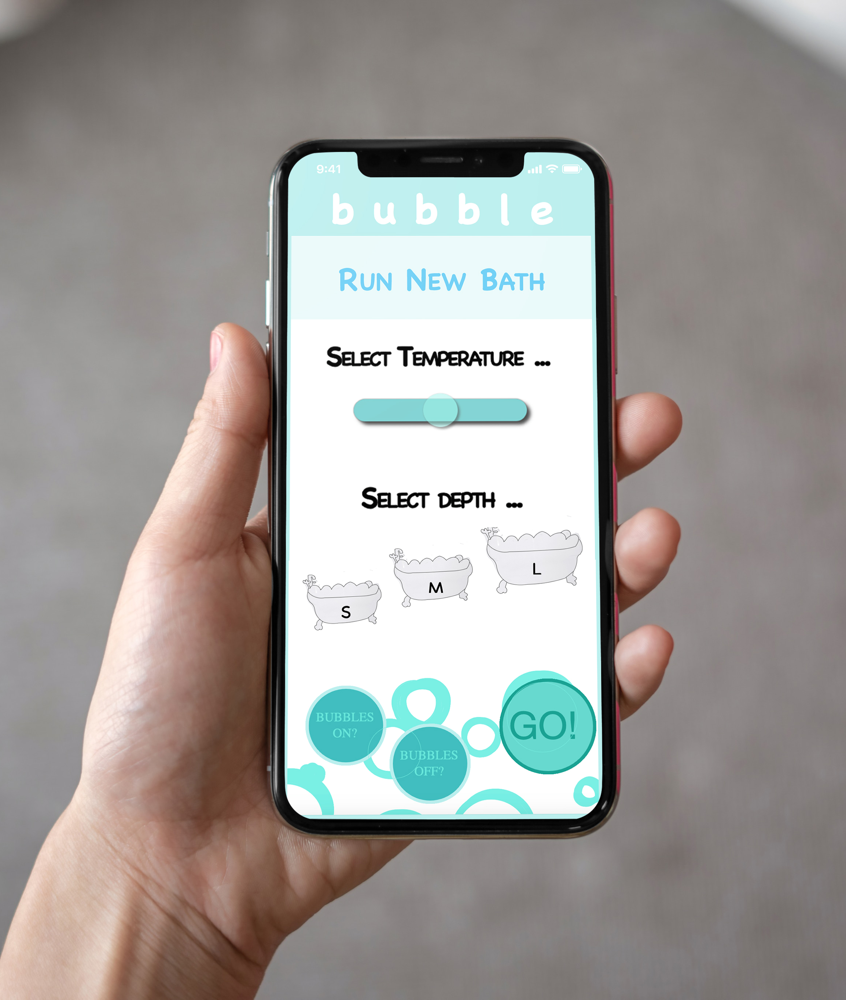
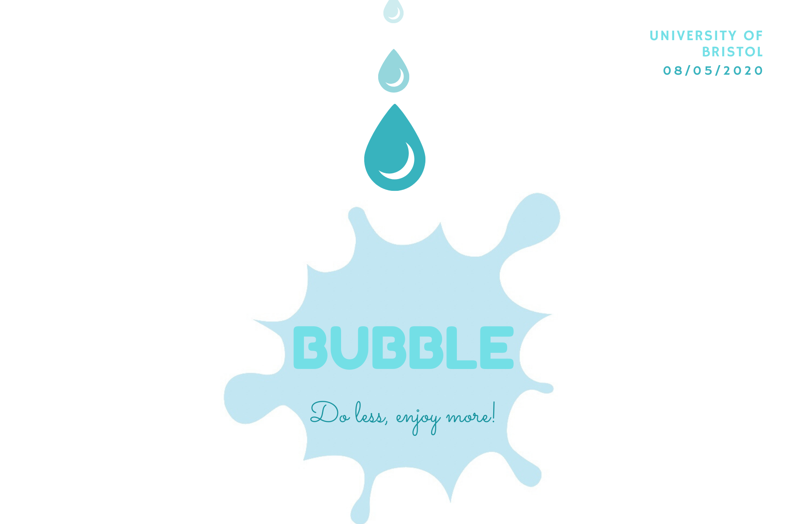

  

  <a href="#our-mission">Our Mission</a> ᛫
  <a href="#who-wins?">Who Wins?</a> ᛫
  <a href="#sections-overview">Sections Overview</a> ᛫
  <a href="#built-with">Built With</a> 
  

   
  

  

# Bubble - Automated Bath Runner
 

  

  

## Our Mission 
Over the last decade, the idea of mass automation has excitingly shifted from a vague possibility to an imminent reality. In the last few years, the world has seen these advancements introduced into the work environment. Society has now discovered the power of tools which when integrated into our homes complete everyday chores and increase leisure time. 

In the midst of this automation revolution, where platforms such as Apple’s Home app are making ‘smart’ products increasingly easy to integrate into routines, taking a bath is trailing the other activities that are undergoing a transformation. The bathroom has seen significantly fewer innovations than the kitchen. The advantages of baths are powerful; from having anti-aging properties, to being one of the most successful stress relief techniques. 

Bubble aims to seize this opportunity and automate bath taking by providing the necessary technology to prepare a user’s ideal bath. The customer side product is composed of an M5Stack that controls the water supply and bath mechanics, and a Web app where users can choose the temperature, depth and whether or not to add bubbles. Getting the perfect water temperature and bubble fill requires tedious and time consuming supervision. With Bubble, one can prepare the ideal bath while commuting home or finishing their workout. Our motto is clear: **do less, enjoy more.** 

## Problem Statement
The bath running process has not kept up with the ‘smart home’ revolution. While most other aspects of our lives have seen significant automation, bath takers are still required to manually run, guess and test baths. Temperature is inaccurately guessed and constant supervision is required to prevent incorrect temperatures or overrunning. Any mistakes often cause wasted water and heating energy, while the final result is so often far from perfect. 

## Who Wins?
To demonstrate the utility of the service, the following example stakeholders would benefit from the existence of a system like Bubbles.
#### User/Customer
A technology welcoming customer would gain the efficiency and convenience of running their bath from afar. While on the way back home in the pouring rain, or from the user’s sofa just in another room, running a bath remotely is time saving and highly advantageous. By removing the human preparation aspect of running a bath, the user’s ideal bath can be recreated every time - not too hot, not too cold. The user only has to give the run command to create their perfect bath from saved presets in minutes. The user can also benefit from scheduled baths, a kind of routine automation that has been welcomed into the kitchen. The user will also know that their bath has been created without wasting any energy - by getting the bath right the first time you eliminate the risk of a wasteful rerun or an unsatsfactory tepid bath!

#### Plumbers & Technicians
Plumbers and company technicians can benefit from the data that a bubble ‘smart’ bath produces. By introducing wifi enabled technology to the bathtub, plumbing issues and technical faults could be self-diagnosed by the system, saving repair time, avoiding unnecessary call outs and eliminating costly misdiagnosed repairs.

#### Third-party apps
After the bath is run, third-parties can benefit from the exposure Bubble can offer them. For example, music streaming services such as Spotify could be opened from the Bubble app to introduce entertainment services to the bath experience. Similarly, to match the introduction of smart lighting in the home, ambient lighting apps could be linked into the Bubble app. A wide variety of third party apps may wish to introduce their services into the bathing process, and Bubble can be a perfect platform to give them exposure.

## Sections Overview
This portfolio is composed of three main sections. Firstly, the system design section considers the architecture of the entire system and the design process to turn a paper prototype into a software environment. The second section details the implementation techniques and methods used to produce a working prototype. Lastly, the evaluation section will analyse the final prototype, as well as touch on future work and working practices during the project. 

## 1) [System Design](System_Design/System_Design.md)
Please find attached our [System Design section](System_Design/System_Design.md) to read about:

* User Stories
* Requirements of Key Subsystems
* Architecture of Entire System
* Object-oriented Design of Key Subsystems
* Evolution of UI Wireframes for Key Subsystems
* Communication Protocols
* Data Persistance Mechanisms 
* Web Technologies in Use

## 2) [System Implementation](System_Implementation/System_Implementation.md)
Please find attached our [System Implementation section](System_Implementation/System_Implementation.md) to read about:

* Sprint Development Process
* Evaluation of Platform Designs
* Social and Ethical Implications of Bubble

## 3) [Project Evaluation](Project_Evaluation/Project_Evaluation.md)
Please find attached our [Project Evaluation section](Project_Evaluation/Project_Evaluation.md) to read about:

* Reflective Discussion on Bubble's Success
* Future Work
* Evaluation of Group Working Practice

## Authors

* [**Christopher Logan**](https://github.com/kitlogan): cl16440@bristol.ac.uk
* [**Andreaa Patrunjel**](https://github.com/andreeaparsley97): ap16989@bristol.ac.uk
* [**Ruby Rosenthal**](https://github.com/rubyrosenthal): rr16973@bristol.ac.uk
* [**Juan Ruiz Pozuelo**](https://github.com/jupozuelo): jr16060@bristol.ac.uk

## Built With

* [Processing](https://processing.org/) 
* [P5.js](https://p5js.org/)

### Processing Libraries

* [MQTT Library for Processing](https://github.com/256dpi/processing-mqtt)
* [ControlP5](http://www.sojamo.de/libraries/controlP5/) 

### P5.js Libraries

* [P5.sound](https://p5js.org/reference/#/libraries/p5.sound)
* [P5.play](https://molleindustria.github.io/p5.play/)
* [P5.clickable](https://github.com/Lartu/p5.clickable)

### M5Stack Libraries 

* [ESP32 Board Manager](https://github.com/espressif/arduino-esp32)
* [U8G2](https://github.com/olikraus/u8g2)
* [PubSubClient library](https://github.com/knolleary/pubsubclient)
* [M5Stack](https://github.com/m5stack/M5Stack)

## Acknowledgments

We greatly appreciated the help and knowledge offered from Simon Lock, Tom Bale, Pete Bennett, and Paul O'Dowd during the entire project. Even despite the COVID-19 pandemic, they have taught as very important skills to apply in industry and have a sucessful careeer. 

  

